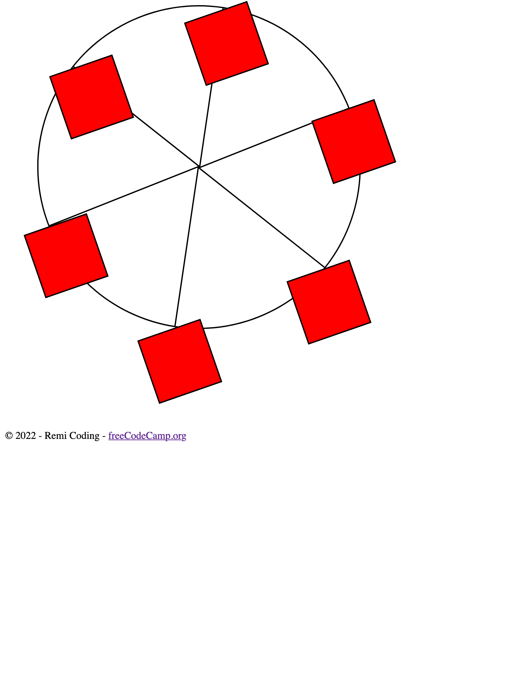

# Ferris Wheel Page

This repository contains the HTML and CSS for the **Learn CSS Animation by Building a Ferris Wheel** course by [freeCodeCamp](https://www.freecodecamp.org/learn/2022/responsive-web-design/).

CSS animation can be used to draw attention to specific sections of the webpage and make it more engaging.

The `index.html` file contains HTML tags and appropriate classes to use to structure and manipulate the elements on the page.

The `css/styles.css` file is used with an emphasis on CSS Animation to build a Ferris wheel. The project allows one to learn how to use CSS to animate elements, transform them, and adjust their speed using `@keyframes` rule and properties.

The page can be viewed here: [Ferris Wheel](https://remicoding.github.io/ferris-wheel-page/)

For your convenience, here are screenshots of the page:

- Large screen webpage:
  
